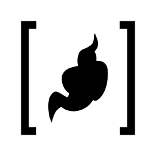
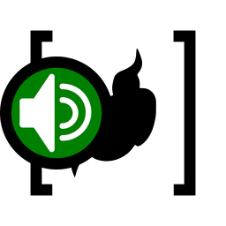
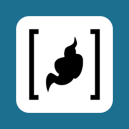
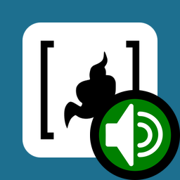

========
Commands
========

Every command is a message to the bot, so it starts with the bot: mention it - in most Matrix clients by typing ``@`` and picking it, shown here as ``@jitsi-bot`` - or use its short name or full user ID, see :doc:`index`.
The commands below are meant to be copied: each is one line, with a real conference URL and chat names you replace with your own.
A conference is its full URL, or - once it is tracked in the chat - its hostname or short name, see :doc:`track-a-conference`.
The first section below puts your own conference into all of them.
The examples use the bot hosted at ``@jitsi-bot:chat.pycal.org``.

Commands that change the bot's settings for a chat only work for a moderator (Matrix power level 50 or higher) and get a ✅ or ❌ reaction on the message.
Every section links to the full reference of its command.

.. _undo-commands:

A command that sets something up is undone by saying ``don't`` or ``do not`` in front of it, and only moderators can do that.
Each command has an *Undo this configuration* part with what is specific to it, and links to what applies to every command.

.. _use-your-conference:

Put your own conference into the examples
=========================================

Enter the URL of your Jitsi conference.
It replaces the example conference in every command and every reply on this page, so you can copy the commands as they are.

.. raw:: html

    

        <label for="conference-url" class="form-label">The URL of your conference</label>
        <input id="conference-url" class="form-control" type="url" inputmode="url"
               autocomplete="off" spellcheck="false"
               placeholder="https://meet.hosted.quelltext.eu/matrix-jitsi-bot"
               aria-describedby="conference-url-message">
        

        <noscript>This needs JavaScript. Without it, replace the example URL by hand.</noscript>
    

    

.. _command-hello:

Say hello to the bot
====================

Check that the bot is there and answering.

.. list-table::
    :widths: 15 85

    *   -   Permission
        -   Everyone
    *   -   See also
        -   :ref:`Getting Started: Talking to the bot <talking-to-the-bot>`, :doc:`Try it out <try-it-out>`
    *   -   API
        -   :py:meth:`~matrix_jitsi_bot.interactions.greeting.GreetingInteraction.react_to_hello`

.. code-block:: text

    @jitsi-bot hello

.. dropdown:: Explanation

    The bot says hello back.
    Anyone can use it, which makes it the quickest way to see whether the bot is there.

    You say:

    .. grid:: 1
        :gutter: 1

        .. grid-item-card::
            :class-card: chat-you sd-bg-light sd-rounded-3

            @jitsi-bot: hello

    The bot answers:

    .. grid:: 1
        :gutter: 1

        .. grid-item-card::
            :class-card: chat-bot sd-bg-primary sd-text-white sd-rounded-3

            Hello!

.. dropdown:: Other ways to say it
    :class-container: other-ways

    **With an exclamation mark**

    .. code-block:: text

        @jitsi-bot hello!

    **Capitalised**

    .. code-block:: text

        @jitsi-bot Hello

.. _command-track:

Write conference updates into a chat
====================================

Notify a chat when a Jitsi conference starts and ends.

The bot reports in this chat when the conference starts and when it ends.
A URL tracked for the first time is checked right away, and nothing is tracked if that fails.
Once a conference is tracked, its hostname or short name - the last part of its URL - can stand for the URL.

.. list-table::
    :widths: 15 85

    *   -   Permission
        -   🔒 Moderators
    *   -   See also
        -   :ref:`Tutorial, step 3: Start tracking <tutorial-start-tracking>`, :doc:`Try it out <try-it-out>`
    *   -   API
        -   :py:meth:`~matrix_jitsi_bot.interactions.chat_notification.ChatNotificationInteraction.react_to_track`, :py:meth:`~matrix_jitsi_bot.interactions.chat_notification.ChatNotificationInteraction.react_to_untrack_flag`, :py:meth:`~matrix_jitsi_bot.interactions.chat_notification.ChatNotificationInteraction.react_to_untrack_one`, :py:meth:`~matrix_jitsi_bot.interactions.chat_notification.ChatNotificationInteraction.react_to_untrack_any`

.. _command-track-start-and-end:

Notify when a conference **starts** and **ends**
------------------------------------------------

.. code-block:: text

    @jitsi-bot track status of https://meet.hosted.quelltext.eu/matrix-jitsi-bot

.. dropdown:: Explanation

    You tell the bot to write the updates of a conference into this chat:

    .. grid:: 1
        :gutter: 1

        .. grid-item-card::
            :class-card: chat-you sd-bg-light sd-rounded-3

            @jitsi-bot: track status of https://meet.hosted.quelltext.eu/matrix-jitsi-bot

    The bot checks that the conference exists, remembers it for this chat, and confirms:

    .. grid:: 1
        :gutter: 1

        .. grid-item-card::
            :class-card: chat-bot sd-bg-success sd-text-white sd-rounded-3

            ✅ Now tracking https://meet.hosted.quelltext.eu/matrix-jitsi-bot.

    From now on the bot keeps an eye on the conference - every second while it was open recently, less often the longer it has been closed.
    It does not join the conference: it only asks whether it exists.
    When the conference opens, because the first person joined, the bot notices within moments and posts:

    .. grid:: 1
        :gutter: 1

        .. grid-item-card::
            :class-card: chat-bot sd-bg-primary sd-text-white sd-rounded-3

            Conference https://meet.hosted.quelltext.eu/matrix-jitsi-bot started

    While people talk, the bot stays quiet: you asked for the start and the end, not for who joins or leaves - see :ref:`command-participants` for that.
    When the last person has left and the conference is closed, the bot posts:

    .. grid:: 1
        :gutter: 1

        .. grid-item-card::
            :class-card: chat-bot sd-bg-primary sd-text-white sd-rounded-3

            Conference https://meet.hosted.quelltext.eu/matrix-jitsi-bot ended

.. dropdown:: Other ways to say it
    :class-container: other-ways

    .. include:: ../_partials/alt-conference-intro.inc

    **Short name**

    .. code-block:: text

        @jitsi-bot track status of matrix-jitsi-bot

    **Hostname**

    .. code-block:: text

        @jitsi-bot track status of meet.hosted.quelltext.eu

    **Without a conference**

    .. code-block:: text

        @jitsi-bot track status of

.. dropdown:: Undo this configuration

    .. include:: ../_partials/undo-intro.inc

    **Stop just this** - the start and the end of this conference:

    .. code-block:: text

        @jitsi-bot don't track status of https://meet.hosted.quelltext.eu/matrix-jitsi-bot

    **Stop only the start messages**, the end messages go on:

    .. code-block:: text

        @jitsi-bot don't track open status of https://meet.hosted.quelltext.eu/matrix-jitsi-bot

    **Stop only the end messages**, the start messages go on:

    .. code-block:: text

        @jitsi-bot don't track close status of https://meet.hosted.quelltext.eu/matrix-jitsi-bot

    **Example** - you change your mind, and the bot stops writing the updates of this conference:

    .. grid:: 1
        :gutter: 1

        .. grid-item-card::
            :class-card: chat-you sd-bg-light sd-rounded-3

            @jitsi-bot: don't track status of https://meet.hosted.quelltext.eu/matrix-jitsi-bot

    .. grid:: 1
        :gutter: 1

        .. grid-item-card::
            :class-card: chat-bot sd-bg-success sd-text-white sd-rounded-3

            ✅ Stopped tracking https://meet.hosted.quelltext.eu/matrix-jitsi-bot.

    .. include:: ../_partials/undo-see-also.inc

.. _command-track-start:

Notify when a conference **starts**
-----------------------------------

.. code-block:: text

    @jitsi-bot track open status of https://meet.hosted.quelltext.eu/matrix-jitsi-bot

.. dropdown:: Explanation

    You tell the bot to write the updates into this chat:

    .. grid:: 1
        :gutter: 1

        .. grid-item-card::
            :class-card: chat-you sd-bg-light sd-rounded-3

            @jitsi-bot: track open status of https://meet.hosted.quelltext.eu/matrix-jitsi-bot

    The bot confirms:

    .. grid:: 1
        :gutter: 1

        .. grid-item-card::
            :class-card: chat-bot sd-bg-success sd-text-white sd-rounded-3

            ✅ Now tracking https://meet.hosted.quelltext.eu/matrix-jitsi-bot.

    From now on the bot keeps an eye on the conference.
    It does not join it: it only asks whether it exists.

    When the conference starts, the bot posts this message:

    .. grid:: 1
        :gutter: 1

        .. grid-item-card::
            :class-card: chat-bot sd-bg-primary sd-text-white sd-rounded-3

            Conference https://meet.hosted.quelltext.eu/matrix-jitsi-bot started

.. dropdown:: Other ways to say it
    :class-container: other-ways

    .. include:: ../_partials/alt-conference-intro.inc

    **Short name**

    .. code-block:: text

        @jitsi-bot track open status of matrix-jitsi-bot

    **Hostname**

    .. code-block:: text

        @jitsi-bot track open status of meet.hosted.quelltext.eu

    **Without a conference**

    .. code-block:: text

        @jitsi-bot track open status of

.. dropdown:: Undo this configuration

    .. include:: ../_partials/undo-intro.inc

    **Stop just this** - the start messages:

    .. code-block:: text

        @jitsi-bot don't track open status of https://meet.hosted.quelltext.eu/matrix-jitsi-bot

    **Stop the start and the end messages**:

    .. code-block:: text

        @jitsi-bot don't track status of https://meet.hosted.quelltext.eu/matrix-jitsi-bot

    **Example**

    .. grid:: 1
        :gutter: 1

        .. grid-item-card::
            :class-card: chat-you sd-bg-light sd-rounded-3

            @jitsi-bot: don't track open status of https://meet.hosted.quelltext.eu/matrix-jitsi-bot

    .. grid:: 1
        :gutter: 1

        .. grid-item-card::
            :class-card: chat-bot sd-bg-success sd-text-white sd-rounded-3

            ✅ Stopped tracking https://meet.hosted.quelltext.eu/matrix-jitsi-bot.

    .. include:: ../_partials/undo-see-also.inc

.. _command-track-end:

Notify when a conference **ends**
---------------------------------

.. code-block:: text

    @jitsi-bot track close status of https://meet.hosted.quelltext.eu/matrix-jitsi-bot

.. dropdown:: Explanation

    You tell the bot to write the updates into this chat:

    .. grid:: 1
        :gutter: 1

        .. grid-item-card::
            :class-card: chat-you sd-bg-light sd-rounded-3

            @jitsi-bot: track close status of https://meet.hosted.quelltext.eu/matrix-jitsi-bot

    The bot confirms:

    .. grid:: 1
        :gutter: 1

        .. grid-item-card::
            :class-card: chat-bot sd-bg-success sd-text-white sd-rounded-3

            ✅ Now tracking https://meet.hosted.quelltext.eu/matrix-jitsi-bot.

    From now on the bot keeps an eye on the conference.
    It does not join it: it only asks whether it exists.

    When the conference ends, the bot posts this message:

    .. grid:: 1
        :gutter: 1

        .. grid-item-card::
            :class-card: chat-bot sd-bg-primary sd-text-white sd-rounded-3

            Conference https://meet.hosted.quelltext.eu/matrix-jitsi-bot ended

.. dropdown:: Other ways to say it
    :class-container: other-ways

    .. include:: ../_partials/alt-conference-intro.inc

    **Short name**

    .. code-block:: text

        @jitsi-bot track close status of matrix-jitsi-bot

    **Hostname**

    .. code-block:: text

        @jitsi-bot track close status of meet.hosted.quelltext.eu

    **Without a conference**

    .. code-block:: text

        @jitsi-bot track close status of

.. dropdown:: Undo this configuration

    .. include:: ../_partials/undo-intro.inc

    **Stop just this** - the end messages:

    .. code-block:: text

        @jitsi-bot don't track close status of https://meet.hosted.quelltext.eu/matrix-jitsi-bot

    **Stop the start and the end messages**:

    .. code-block:: text

        @jitsi-bot don't track status of https://meet.hosted.quelltext.eu/matrix-jitsi-bot

    **Example**

    .. grid:: 1
        :gutter: 1

        .. grid-item-card::
            :class-card: chat-you sd-bg-light sd-rounded-3

            @jitsi-bot: don't track close status of https://meet.hosted.quelltext.eu/matrix-jitsi-bot

    .. grid:: 1
        :gutter: 1

        .. grid-item-card::
            :class-card: chat-bot sd-bg-success sd-text-white sd-rounded-3

            ✅ Stopped tracking https://meet.hosted.quelltext.eu/matrix-jitsi-bot.

    .. include:: ../_partials/undo-see-also.inc

.. _command-participants:

Update the chat about participants
==================================

Notify a chat who joins and leaves a Jitsi conference.

The bot reports in this chat who is in the conference.
While the conference is open and a chat tracks who joins or leaves, the bot stays in it, so it reports joins and leaves the moment they happen.
Once a conference is tracked, its hostname or short name - the last part of its URL - can stand for the URL.

.. list-table::
    :widths: 15 85

    *   -   Permission
        -   🔒 Moderators
    *   -   See also
        -   :ref:`Tutorial, step 3: Start tracking <tutorial-start-tracking>`, :doc:`Try it out <try-it-out>`, :ref:`Self hosting: Staying in Jitsi conferences <staying-in-conferences>`
    *   -   API
        -   :py:meth:`~matrix_jitsi_bot.interactions.chat_notification.ChatNotificationInteraction.react_to_track`, :py:meth:`~matrix_jitsi_bot.interactions.chat_notification.ChatNotificationInteraction.react_to_untrack_flag`, :py:meth:`~matrix_jitsi_bot.interactions.chat_notification.ChatNotificationInteraction.react_to_untrack_one`, :py:meth:`~matrix_jitsi_bot.interactions.chat_notification.ChatNotificationInteraction.react_to_untrack_any`

.. _command-track-join-and-leave:

Notify when someone **joins** or **leaves** a conference
--------------------------------------------------------

.. code-block:: text

    @jitsi-bot track who is in https://meet.hosted.quelltext.eu/matrix-jitsi-bot

.. dropdown:: Explanation

    You tell the bot to write the updates into this chat:

    .. grid:: 1
        :gutter: 1

        .. grid-item-card::
            :class-card: chat-you sd-bg-light sd-rounded-3

            @jitsi-bot: track who is in https://meet.hosted.quelltext.eu/matrix-jitsi-bot

    The bot confirms:

    .. grid:: 1
        :gutter: 1

        .. grid-item-card::
            :class-card: chat-bot sd-bg-success sd-text-white sd-rounded-3

            ✅ Now tracking https://meet.hosted.quelltext.eu/matrix-jitsi-bot.

    From now on the bot keeps an eye on the conference.
    As soon as the conference is open, the bot joins it and stays in it, so it sees every join and leave the moment it happens.
    The others see the bot as a participant, with its name and avatar.
    It leaves again when the conference is closed - also when the bot is the only one left in it - or when nobody tracks joins and leaves of it anymore; see :ref:`Self hosting: Staying in Jitsi conferences <staying-in-conferences>` and :ref:`Name and avatar in a conference <name-and-avatar-in-a-conference>`.

    When someone joins the conference, the bot posts this message:

    .. grid:: 1
        :gutter: 1

        .. grid-item-card::
            :class-card: chat-bot sd-bg-primary sd-text-white sd-rounded-3

            Alice joined https://meet.hosted.quelltext.eu/matrix-jitsi-bot

    When someone leaves the conference, the bot posts this message:

    .. grid:: 1
        :gutter: 1

        .. grid-item-card::
            :class-card: chat-bot sd-bg-primary sd-text-white sd-rounded-3

            Alice left https://meet.hosted.quelltext.eu/matrix-jitsi-bot

.. dropdown:: Other ways to say it
    :class-container: other-ways

    .. include:: ../_partials/alt-conference-intro.inc

    **Short name**

    .. code-block:: text

        @jitsi-bot track who is in matrix-jitsi-bot

    **Hostname**

    .. code-block:: text

        @jitsi-bot track who is in meet.hosted.quelltext.eu

    **Without a conference**

    .. code-block:: text

        @jitsi-bot track who is in

.. dropdown:: Undo this configuration

    .. include:: ../_partials/undo-intro.inc

    **Stop just this** - the joins and the leaves:

    .. code-block:: text

        @jitsi-bot don't track who is in https://meet.hosted.quelltext.eu/matrix-jitsi-bot

    **Stop only the joins**, the leaves go on:

    .. code-block:: text

        @jitsi-bot don't track who joins https://meet.hosted.quelltext.eu/matrix-jitsi-bot

    **Stop only the leaves**, the joins go on:

    .. code-block:: text

        @jitsi-bot don't track who leaves https://meet.hosted.quelltext.eu/matrix-jitsi-bot

    **Example**

    .. grid:: 1
        :gutter: 1

        .. grid-item-card::
            :class-card: chat-you sd-bg-light sd-rounded-3

            @jitsi-bot: don't track who is in https://meet.hosted.quelltext.eu/matrix-jitsi-bot

    .. grid:: 1
        :gutter: 1

        .. grid-item-card::
            :class-card: chat-bot sd-bg-success sd-text-white sd-rounded-3

            ✅ Stopped tracking https://meet.hosted.quelltext.eu/matrix-jitsi-bot.

    .. include:: ../_partials/undo-see-also.inc

.. _command-track-join:

Notify when someone **joins** a conference
------------------------------------------

.. code-block:: text

    @jitsi-bot track who joins https://meet.hosted.quelltext.eu/matrix-jitsi-bot

.. dropdown:: Explanation

    You tell the bot to write the updates into this chat:

    .. grid:: 1
        :gutter: 1

        .. grid-item-card::
            :class-card: chat-you sd-bg-light sd-rounded-3

            @jitsi-bot: track who joins https://meet.hosted.quelltext.eu/matrix-jitsi-bot

    The bot confirms:

    .. grid:: 1
        :gutter: 1

        .. grid-item-card::
            :class-card: chat-bot sd-bg-success sd-text-white sd-rounded-3

            ✅ Now tracking https://meet.hosted.quelltext.eu/matrix-jitsi-bot.

    From now on the bot keeps an eye on the conference.
    As soon as the conference is open, the bot joins it and stays in it, so it sees every join and leave the moment it happens.
    The others see the bot as a participant, with its name and avatar.
    It leaves again when the conference is closed - also when the bot is the only one left in it - or when nobody tracks joins and leaves of it anymore; see :ref:`Self hosting: Staying in Jitsi conferences <staying-in-conferences>` and :ref:`Name and avatar in a conference <name-and-avatar-in-a-conference>`.

    When someone joins the conference, the bot posts this message:

    .. grid:: 1
        :gutter: 1

        .. grid-item-card::
            :class-card: chat-bot sd-bg-primary sd-text-white sd-rounded-3

            Alice joined https://meet.hosted.quelltext.eu/matrix-jitsi-bot

.. dropdown:: Other ways to say it
    :class-container: other-ways

    .. include:: ../_partials/alt-conference-intro.inc

    **Short name**

    .. code-block:: text

        @jitsi-bot track who joins matrix-jitsi-bot

    **Hostname**

    .. code-block:: text

        @jitsi-bot track who joins meet.hosted.quelltext.eu

    **Without a conference**

    .. code-block:: text

        @jitsi-bot track who joins

.. dropdown:: Undo this configuration

    .. include:: ../_partials/undo-intro.inc

    **Stop just this** - the joins:

    .. code-block:: text

        @jitsi-bot don't track who joins https://meet.hosted.quelltext.eu/matrix-jitsi-bot

    **Stop the joins and the leaves**:

    .. code-block:: text

        @jitsi-bot don't track who is in https://meet.hosted.quelltext.eu/matrix-jitsi-bot

    **Example**

    .. grid:: 1
        :gutter: 1

        .. grid-item-card::
            :class-card: chat-you sd-bg-light sd-rounded-3

            @jitsi-bot: don't track who joins https://meet.hosted.quelltext.eu/matrix-jitsi-bot

    .. grid:: 1
        :gutter: 1

        .. grid-item-card::
            :class-card: chat-bot sd-bg-success sd-text-white sd-rounded-3

            ✅ Stopped tracking https://meet.hosted.quelltext.eu/matrix-jitsi-bot.

    .. include:: ../_partials/undo-see-also.inc

.. _command-track-leave:

Notify when someone **leaves** a conference
-------------------------------------------

.. code-block:: text

    @jitsi-bot track who leaves https://meet.hosted.quelltext.eu/matrix-jitsi-bot

.. dropdown:: Explanation

    You tell the bot to write the updates into this chat:

    .. grid:: 1
        :gutter: 1

        .. grid-item-card::
            :class-card: chat-you sd-bg-light sd-rounded-3

            @jitsi-bot: track who leaves https://meet.hosted.quelltext.eu/matrix-jitsi-bot

    The bot confirms:

    .. grid:: 1
        :gutter: 1

        .. grid-item-card::
            :class-card: chat-bot sd-bg-success sd-text-white sd-rounded-3

            ✅ Now tracking https://meet.hosted.quelltext.eu/matrix-jitsi-bot.

    From now on the bot keeps an eye on the conference.
    As soon as the conference is open, the bot joins it and stays in it, so it sees every join and leave the moment it happens.
    The others see the bot as a participant, with its name and avatar.
    It leaves again when the conference is closed - also when the bot is the only one left in it - or when nobody tracks joins and leaves of it anymore; see :ref:`Self hosting: Staying in Jitsi conferences <staying-in-conferences>` and :ref:`Name and avatar in a conference <name-and-avatar-in-a-conference>`.

    When someone leaves the conference, the bot posts this message:

    .. grid:: 1
        :gutter: 1

        .. grid-item-card::
            :class-card: chat-bot sd-bg-primary sd-text-white sd-rounded-3

            Alice left https://meet.hosted.quelltext.eu/matrix-jitsi-bot

.. dropdown:: Other ways to say it
    :class-container: other-ways

    .. include:: ../_partials/alt-conference-intro.inc

    **Short name**

    .. code-block:: text

        @jitsi-bot track who leaves matrix-jitsi-bot

    **Hostname**

    .. code-block:: text

        @jitsi-bot track who leaves meet.hosted.quelltext.eu

    **Without a conference**

    .. code-block:: text

        @jitsi-bot track who leaves

.. dropdown:: Undo this configuration

    .. include:: ../_partials/undo-intro.inc

    **Stop just this** - the leaves:

    .. code-block:: text

        @jitsi-bot don't track who leaves https://meet.hosted.quelltext.eu/matrix-jitsi-bot

    **Stop the joins and the leaves**:

    .. code-block:: text

        @jitsi-bot don't track who is in https://meet.hosted.quelltext.eu/matrix-jitsi-bot

    **Example**

    .. grid:: 1
        :gutter: 1

        .. grid-item-card::
            :class-card: chat-you sd-bg-light sd-rounded-3

            @jitsi-bot: don't track who leaves https://meet.hosted.quelltext.eu/matrix-jitsi-bot

    .. grid:: 1
        :gutter: 1

        .. grid-item-card::
            :class-card: chat-bot sd-bg-success sd-text-white sd-rounded-3

            ✅ Stopped tracking https://meet.hosted.quelltext.eu/matrix-jitsi-bot.

    .. include:: ../_partials/undo-see-also.inc

.. _command-track-who-is-there:

Notify who is in a conference when it **starts**
------------------------------------------------

.. code-block:: text

    @jitsi-bot track who starts https://meet.hosted.quelltext.eu/matrix-jitsi-bot

.. dropdown:: Explanation

    You tell the bot to write the updates into this chat:

    .. grid:: 1
        :gutter: 1

        .. grid-item-card::
            :class-card: chat-you sd-bg-light sd-rounded-3

            @jitsi-bot: track who starts https://meet.hosted.quelltext.eu/matrix-jitsi-bot

    The bot confirms:

    .. grid:: 1
        :gutter: 1

        .. grid-item-card::
            :class-card: chat-bot sd-bg-success sd-text-white sd-rounded-3

            ✅ Now tracking https://meet.hosted.quelltext.eu/matrix-jitsi-bot.

    From now on the bot keeps an eye on the conference.
    When it notices that the conference is open, it joins briefly to read who is in it, and leaves again right away: it does not stay; see :ref:`Self hosting: Staying in Jitsi conferences <staying-in-conferences>` and :ref:`Name and avatar in a conference <name-and-avatar-in-a-conference>`.

    When the conference starts, the bot posts who is in it:

    .. grid:: 1
        :gutter: 1

        .. grid-item-card::
            :class-card: chat-bot sd-bg-primary sd-text-white sd-rounded-3

            Alice, Bob started the conference at https://meet.hosted.quelltext.eu/matrix-jitsi-bot

.. dropdown:: Other ways to say it
    :class-container: other-ways

    .. include:: ../_partials/alt-conference-intro.inc

    **Short name**

    .. code-block:: text

        @jitsi-bot track who starts matrix-jitsi-bot

    **Hostname**

    .. code-block:: text

        @jitsi-bot track who starts meet.hosted.quelltext.eu

    **Without a conference**

    .. code-block:: text

        @jitsi-bot track who starts

.. dropdown:: Undo this configuration

    .. include:: ../_partials/undo-intro.inc

    **Stop just this** - who is in the conference when it starts:

    .. code-block:: text

        @jitsi-bot don't track who starts https://meet.hosted.quelltext.eu/matrix-jitsi-bot

    **Example**

    .. grid:: 1
        :gutter: 1

        .. grid-item-card::
            :class-card: chat-you sd-bg-light sd-rounded-3

            @jitsi-bot: don't track who starts https://meet.hosted.quelltext.eu/matrix-jitsi-bot

    .. grid:: 1
        :gutter: 1

        .. grid-item-card::
            :class-card: chat-bot sd-bg-success sd-text-white sd-rounded-3

            ✅ Stopped tracking https://meet.hosted.quelltext.eu/matrix-jitsi-bot.

    .. include:: ../_partials/undo-see-also.inc

.. _command-check:

Look at a conference right now
==============================

Ask the bot for the current state of a conference, without waiting for its next check.

.. list-table::
    :widths: 15 85

    *   -   Permission
        -   Everyone
    *   -   See also
        -   :doc:`Try it out <try-it-out>`, :ref:`Tutorial, step 3: Start tracking <tutorial-start-tracking>`
    *   -   API
        -   :py:meth:`~matrix_jitsi_bot.interactions.chat_notification.ChatNotificationInteraction.react_to_check`, :py:meth:`~matrix_jitsi_bot.jitsi.check_jitsi_room`

Every tracked conference:

.. code-block:: text

    @jitsi-bot check

Or one of them:

.. code-block:: text

    @jitsi-bot check https://meet.hosted.quelltext.eu/matrix-jitsi-bot

.. dropdown:: Explanation

    Looks at the tracked conference - or at all of them - right now and tells what it found, instead of waiting for the next check.
    A conference checked a few seconds ago is answered from the database.
    It joins a conference only to read who is in it, and only if who is in it is tracked here: briefly, and not at all while the bot is in it already.

    You say:

    .. grid:: 1
        :gutter: 1

        .. grid-item-card::
            :class-card: chat-you sd-bg-light sd-rounded-3

            @jitsi-bot: check https://meet.hosted.quelltext.eu/matrix-jitsi-bot

    The bot looks at the conference right now, and tells what it found:

    .. grid:: 1
        :gutter: 1

        .. grid-item-card::
            :class-card: chat-bot sd-bg-primary sd-text-white sd-rounded-3

            https://meet.hosted.quelltext.eu/matrix-jitsi-bot: closed

.. dropdown:: Other ways to say it
    :class-container: other-ways

    .. include:: ../_partials/alt-conference-intro.inc

    **Short name**

    .. code-block:: text

        @jitsi-bot check matrix-jitsi-bot

    **Hostname**

    .. code-block:: text

        @jitsi-bot check meet.hosted.quelltext.eu

.. _command-status:

See what a chat tracks
======================

List the conferences a chat is set up for, what was last found out about them, and which avatars change for them.

.. list-table::
    :widths: 15 85

    *   -   Permission
        -   Everyone
    *   -   See also
        -   :doc:`Try it out <try-it-out>`, :ref:`Tutorial, step 3: Start tracking <tutorial-start-tracking>`
    *   -   API
        -   :py:meth:`~matrix_jitsi_bot.interactions.chat_notification.ChatNotificationInteraction.react_to_status`

.. code-block:: text

    @jitsi-bot status

.. dropdown:: Explanation

    Lists every conference tracked in this chat and what was last found out about it.
    Below each conference are the avatars that change while it is open: the avatar of this chat and of the spaces set up for it.
    It says when the speaker is shown on one right now.
    It answers from the database, without asking the conference, so it is instant; use :ref:`check <command-check>` for a fresh look.

    You say:

    .. grid:: 1
        :gutter: 1

        .. grid-item-card::
            :class-card: chat-you sd-bg-light sd-rounded-3

            @jitsi-bot: status

    The bot answers from what it knows:

    .. grid:: 1
        :gutter: 1

        .. grid-item-card::
            :class-card: chat-bot sd-bg-primary sd-text-white sd-rounded-3

            https://meet.hosted.quelltext.eu/matrix-jitsi-bot: open, with Alice

            - changes the avatar of this chat (speaker shown now)

            - changes the avatar of #jitsi-bot:chat.pycal.org (speaker shown now)

.. _command-change-avatar:

Change the room avatar image
============================

Draw a speaker on the avatar of a chat while a conference is happening.

.. list-table::
    :widths: 15 85

    *   -   Permission
        -   🔒 Moderators.
            The bot also needs moderator permissions in the chat.
    *   -   See also
        -   :ref:`Tutorial: Show that a conference is active <tutorial-show-active>`, :ref:`Getting Started: Moderator-only commands <moderator-only-commands>`
    *   -   API
        -   :py:meth:`~matrix_jitsi_bot.interactions.avatar.AvatarInteraction.react_to_change_avatar`, :py:meth:`~matrix_jitsi_bot.interactions.avatar.AvatarInteraction.react_to_keep_avatar`, :py:meth:`~matrix_jitsi_bot.bot.MatrixJitsiBot.update_speaker_avatars`

The avatar of this chat:

.. code-block:: text

    @jitsi-bot change avatar when https://meet.hosted.quelltext.eu/matrix-jitsi-bot is active

The avatar of the chat before, and while the conference is open:

|room-before| → |room-after|

.. dropdown:: Explanation

    While the conference is open, a speaker is drawn on the avatar of this chat, at the left edge in the middle of the height.
    When the conference closes, the original avatar is back.
    A chat without an avatar gets the whole speaker as its avatar.
    The bot must be allowed to change the avatar of the chat; if it is not, it says so.
    See :doc:`track-a-conference` for more.

    You say:

    .. grid:: 1
        :gutter: 1

        .. grid-item-card::
            :class-card: chat-you sd-bg-light sd-rounded-3

            @jitsi-bot: change avatar when https://meet.hosted.quelltext.eu/matrix-jitsi-bot is active

    The bot confirms - from now on a speaker is drawn on the avatar while the conference is open:

    .. grid:: 1
        :gutter: 1

        .. grid-item-card::
            :class-card: chat-bot sd-bg-success sd-text-white sd-rounded-3

            ✅ Now tracking https://meet.hosted.quelltext.eu/matrix-jitsi-bot. A speaker is shown on the room's avatar while it is active.

.. dropdown:: Other ways to say it
    :class-container: other-ways

    **Said explicitly**

    .. code-block:: text

        @jitsi-bot change avatar of this chat when https://meet.hosted.quelltext.eu/matrix-jitsi-bot is active

    **Said explicitly, with the word room**

    .. code-block:: text

        @jitsi-bot change avatar of this room when https://meet.hosted.quelltext.eu/matrix-jitsi-bot is active

    **Short name**

    .. code-block:: text

        @jitsi-bot change avatar when matrix-jitsi-bot is active

    **Hostname**

    .. code-block:: text

        @jitsi-bot change avatar when meet.hosted.quelltext.eu is active

    **Without a conference**

    .. code-block:: text

        @jitsi-bot change avatar when is active

.. dropdown:: Undo this configuration

    .. include:: ../_partials/undo-intro.inc

    **Stop changing the avatar of this chat** - the original avatar comes back (``of this chat`` and ``of this room`` work as well):

    .. code-block:: text

        @jitsi-bot don't change avatar when https://meet.hosted.quelltext.eu/matrix-jitsi-bot is active

    **Example**

    .. grid:: 1
        :gutter: 1

        .. grid-item-card::
            :class-card: chat-you sd-bg-light sd-rounded-3

            @jitsi-bot: don't change avatar when https://meet.hosted.quelltext.eu/matrix-jitsi-bot is active

    .. grid:: 1
        :gutter: 1

        .. grid-item-card::
            :class-card: chat-bot sd-bg-success sd-text-white sd-rounded-3

            ✅ Stopped tracking https://meet.hosted.quelltext.eu/matrix-jitsi-bot.

    .. include:: ../_partials/undo-see-also.inc

.. _command-change-space-avatar:

Change the space avatar image
=============================

Draw a speaker on the avatar of a space that lists this chat while a conference is happening.

.. list-table::
    :widths: 15 85

    *   -   Permission
        -   🔒 Moderators.
            The bot also needs moderator permissions in the space.
    *   -   See also
        -   :ref:`Tutorial: Show that a conference is active <tutorial-show-active>`, :ref:`Getting Started: Moderator-only commands <moderator-only-commands>`
    *   -   API
        -   :py:meth:`~matrix_jitsi_bot.interactions.avatar.AvatarInteraction.react_to_change_avatar`, :py:meth:`~matrix_jitsi_bot.interactions.avatar.AvatarInteraction.react_to_keep_avatar`, :py:meth:`~matrix_jitsi_bot.bot.MatrixJitsiBot.update_speaker_avatars`

Use the alias of your space:

.. code-block:: text

    @jitsi-bot change avatar of #jitsi-bot:chat.pycal.org when https://meet.hosted.quelltext.eu/matrix-jitsi-bot is active

The avatar of the space before, and while the conference is open:

|space-before| → |space-after|

.. dropdown:: Explanation

    While the conference is open, a speaker is drawn on the avatar of the space, at the bottom right.
    When the conference closes, the original avatar is back.
    A space without an avatar gets the whole speaker as its avatar.
    The space must list this chat, you must be allowed to change its avatar yourself, and the bot must be allowed to too.
    The bot joins the space if it must, and asks for an invitation first if it cannot.
    See :doc:`track-a-conference` for more.

    You say:

    .. grid:: 1
        :gutter: 1

        .. grid-item-card::
            :class-card: chat-you sd-bg-light sd-rounded-3

            @jitsi-bot: change avatar of #jitsi-bot:chat.pycal.org when https://meet.hosted.quelltext.eu/matrix-jitsi-bot is active

    The bot confirms - from now on a speaker is drawn on the avatar of the space while the conference is open:

    .. grid:: 1
        :gutter: 1

        .. grid-item-card::
            :class-card: chat-bot sd-bg-success sd-text-white sd-rounded-3

            ✅ Now tracking https://meet.hosted.quelltext.eu/matrix-jitsi-bot. A speaker is shown on the avatar of #jitsi-bot:chat.pycal.org while it is active.

.. dropdown:: Other ways to say it
    :class-container: other-ways

    **The space by its room ID**

    .. code-block:: text

        @jitsi-bot change avatar of !roomid:chat.pycal.org when https://meet.hosted.quelltext.eu/matrix-jitsi-bot is active

    **Short name**

    .. code-block:: text

        @jitsi-bot change avatar of #jitsi-bot:chat.pycal.org when matrix-jitsi-bot is active

    **Hostname**

    .. code-block:: text

        @jitsi-bot change avatar of #jitsi-bot:chat.pycal.org when meet.hosted.quelltext.eu is active

.. dropdown:: Undo this configuration

    .. include:: ../_partials/undo-intro.inc

    **Stop changing the avatar of the space** - use the alias you set it up with:

    .. code-block:: text

        @jitsi-bot don't change avatar of #jitsi-bot:chat.pycal.org when https://meet.hosted.quelltext.eu/matrix-jitsi-bot is active

    **Example**

    .. grid:: 1
        :gutter: 1

        .. grid-item-card::
            :class-card: chat-you sd-bg-light sd-rounded-3

            @jitsi-bot: don't change avatar of #jitsi-bot:chat.pycal.org when https://meet.hosted.quelltext.eu/matrix-jitsi-bot is active

    .. grid:: 1
        :gutter: 1

        .. grid-item-card::
            :class-card: chat-bot sd-bg-success sd-text-white sd-rounded-3

            ✅ I no longer change the avatar of #jitsi-bot:chat.pycal.org for https://meet.hosted.quelltext.eu/matrix-jitsi-bot.

    .. include:: ../_partials/undo-see-also.inc

.. _command-untrack:

Stop tracking a conference
==========================

Stop everything the bot does for one conference in a chat - the updates and the avatar changes alike.

.. list-table::
    :widths: 15 85

    *   -   Permission
        -   🔒 Moderators
    *   -   See also
        -   :ref:`Tutorial, step 4: Undo a setting, or stop entirely <tutorial-undo>`, :ref:`Getting Started: Moderator-only commands <moderator-only-commands>`
    *   -   API
        -   :py:meth:`~matrix_jitsi_bot.interactions.chat_notification.ChatNotificationInteraction.react_to_untrack_one`

.. code-block:: text

    @jitsi-bot don't track https://meet.hosted.quelltext.eu/matrix-jitsi-bot

.. dropdown:: Explanation

    This stops everything the bot does for this conference in this chat.
    The reports stop, and the avatars that were changed for it - of the chat and of its spaces - get their original pictures back.
    Other conferences of the chat go on.

    You say:

    .. grid:: 1
        :gutter: 1

        .. grid-item-card::
            :class-card: chat-you sd-bg-light sd-rounded-3

            @jitsi-bot: don't track https://meet.hosted.quelltext.eu/matrix-jitsi-bot

    The bot forgets the conference for this chat, and confirms:

    .. grid:: 1
        :gutter: 1

        .. grid-item-card::
            :class-card: chat-bot sd-bg-success sd-text-white sd-rounded-3

            ✅ Stopped tracking https://meet.hosted.quelltext.eu/matrix-jitsi-bot.

.. dropdown:: Other ways to say it
    :class-container: other-ways

    .. include:: ../_partials/alt-conference-intro.inc

    **Short name**

    .. code-block:: text

        @jitsi-bot don't track matrix-jitsi-bot

    **Hostname**

    .. code-block:: text

        @jitsi-bot don't track meet.hosted.quelltext.eu

    **Without a conference**

    .. code-block:: text

        @jitsi-bot don't track

    **With the words do not**

    .. code-block:: text

        @jitsi-bot do not track https://meet.hosted.quelltext.eu/matrix-jitsi-bot

.. dropdown:: Undo this configuration

    .. include:: ../_partials/undo-intro.inc

    There is nothing to restore, as the bot has forgotten the conference: track it again with the commands of :ref:`command-track` and :ref:`command-participants`, and change the avatars again with :ref:`command-change-avatar` and :ref:`command-change-space-avatar`.

    .. include:: ../_partials/undo-see-also.inc

.. _command-reset:

Reset the configuration of a chat
=================================

Stop everything the bot does for every conference in a chat - the updates and the avatar changes alike.

.. list-table::
    :widths: 15 85

    *   -   Permission
        -   🔒 Moderators
    *   -   See also
        -   :ref:`Tutorial, step 4: Undo a setting, or stop entirely <tutorial-undo>`, :ref:`Getting Started: Moderator-only commands <moderator-only-commands>`
    *   -   API
        -   :py:meth:`~matrix_jitsi_bot.interactions.chat_notification.ChatNotificationInteraction.react_to_untrack_any`

.. code-block:: text

    @jitsi-bot don't track any

.. dropdown:: Explanation

    This resets the configuration of the chat: it stops everything the bot does for every conference in it.
    The reports stop, and the avatars that were changed - of the chat and of its spaces - get their original pictures back.

    You say:

    .. grid:: 1
        :gutter: 1

        .. grid-item-card::
            :class-card: chat-you sd-bg-light sd-rounded-3

            @jitsi-bot: don't track any

    The bot forgets what it was asked to do in this chat, and confirms:

    .. grid:: 1
        :gutter: 1

        .. grid-item-card::
            :class-card: chat-bot sd-bg-success sd-text-white sd-rounded-3

            ✅ Stopped tracking every conference in this room.

.. dropdown:: Other ways to say it
    :class-container: other-ways

    **With the words do not**

    .. code-block:: text

        @jitsi-bot do not track any

.. dropdown:: Undo this configuration

    .. include:: ../_partials/undo-intro.inc

    Nothing can be restored, as the bot has forgotten it: set the chat up again with the commands of :ref:`command-track`, :ref:`command-participants`, :ref:`command-change-avatar` and :ref:`command-change-space-avatar`.

.. _command-pause:

Pause the updates of a chat
===========================

Stop the bot's updates in a chat for a while, and keep its settings.

The chat keeps its configuration, but the bot stops reporting and reacts to nothing except resuming.

.. list-table::
    :widths: 15 85

    *   -   Permission
        -   🔒 Moderators
    *   -   See also
        -   :ref:`Getting Started: While a chat is paused <paused-rooms>`, :ref:`Tutorial, step 4: Undo a setting, or stop entirely <tutorial-undo>`
    *   -   API
        -   :py:meth:`~matrix_jitsi_bot.interactions.room.RoomInteraction.react_to_pause`, :py:meth:`~matrix_jitsi_bot.interactions.room.RoomInteraction.react_to_unpause`

.. _command-pause-pause:

Pause the updates
-----------------

.. code-block:: text

    @jitsi-bot pause tracking

.. dropdown:: Explanation

    The chat keeps its configuration, but the bot stops reporting and reacts to nothing except resuming.

    You say:

    .. grid:: 1
        :gutter: 1

        .. grid-item-card::
            :class-card: chat-you sd-bg-light sd-rounded-3

            @jitsi-bot: pause tracking

    The bot confirms, and from now on stays silent:

    .. grid:: 1
        :gutter: 1

        .. grid-item-card::
            :class-card: chat-bot sd-bg-success sd-text-white sd-rounded-3

            ✅ Tracking paused.

.. dropdown:: Other ways to say it
    :class-container: other-ways

    **Without the word tracking**

    .. code-block:: text

        @jitsi-bot pause

.. dropdown:: Undo this configuration

    .. include:: ../_partials/undo-intro.inc

    **Resume the updates** - everything is as it was before the pause:

    .. code-block:: text

        @jitsi-bot unpause tracking

    **Example**

    .. grid:: 1
        :gutter: 1

        .. grid-item-card::
            :class-card: chat-you sd-bg-light sd-rounded-3

            @jitsi-bot: unpause tracking

    .. grid:: 1
        :gutter: 1

        .. grid-item-card::
            :class-card: chat-bot sd-bg-success sd-text-white sd-rounded-3

            ✅ Tracking resumed.

.. _command-pause-resume:

Resume the updates
------------------

.. code-block:: text

    @jitsi-bot unpause tracking

.. dropdown:: Explanation

    The bot reports again, as before the pause.
    If the chat is not paused, the bot says so.

    You say:

    .. grid:: 1
        :gutter: 1

        .. grid-item-card::
            :class-card: chat-you sd-bg-light sd-rounded-3

            @jitsi-bot: unpause tracking

    The bot confirms, and from now on reports again:

    .. grid:: 1
        :gutter: 1

        .. grid-item-card::
            :class-card: chat-bot sd-bg-success sd-text-white sd-rounded-3

            ✅ Tracking resumed.

.. dropdown:: Other ways to say it
    :class-container: other-ways

    **Without the word tracking**

    .. code-block:: text

        @jitsi-bot unpause

.. dropdown:: Undo this configuration

    .. include:: ../_partials/undo-intro.inc

    **Pause the updates again**:

    .. code-block:: text

        @jitsi-bot pause tracking

    **Example**

    .. grid:: 1
        :gutter: 1

        .. grid-item-card::
            :class-card: chat-you sd-bg-light sd-rounded-3

            @jitsi-bot: pause tracking

    .. grid:: 1
        :gutter: 1

        .. grid-item-card::
            :class-card: chat-bot sd-bg-success sd-text-white sd-rounded-3

            ✅ Tracking paused.

.. _command-leave:

Remove the bot from a chat
==========================

Make the bot leave a chat and forget it.

.. list-table::
    :widths: 15 85

    *   -   Permission
        -   🔒 Moderators
    *   -   See also
        -   :ref:`Getting Started: Inviting the bot <inviting-the-bot>`, :ref:`Tutorial, step 1: Get the bot into a chat <tutorial-invite-the-bot>`
    *   -   API
        -   :py:meth:`~matrix_jitsi_bot.interactions.room.RoomInteraction.react_to_leave`

.. code-block:: text

    @jitsi-bot leave

.. dropdown:: Explanation

    The bot leaves the chat and forgets everything it was told here.
    If it was showing a speaker on an avatar, the avatar is restored first.

    You say:

    .. grid:: 1
        :gutter: 1

        .. grid-item-card::
            :class-card: chat-you sd-bg-light sd-rounded-3

            @jitsi-bot: leave

    The bot says goodbye, restores the avatars, and leaves:

    .. grid:: 1
        :gutter: 1

        .. grid-item-card::
            :class-card: chat-bot sd-bg-success sd-text-white sd-rounded-3

            ✅ Leaving this room now. Goodbye!

.. dropdown:: Undo this configuration

    The bot has forgotten the chat, so there is nothing to switch off: invite it again and set it up anew, see :doc:`track-a-conference`.

.. _command-help:

List what the bot can do
========================

Show every command the bot understands.

.. list-table::
    :widths: 15 85

    *   -   Permission
        -   Everyone
    *   -   See also
        -   :ref:`Getting Started: Talking to the bot <talking-to-the-bot>`, :doc:`Try it out <try-it-out>`
    *   -   API
        -   :py:meth:`~matrix_jitsi_bot.interactions.help.HelpInteraction.react_to_help`, :py:meth:`~matrix_jitsi_bot.interactions.help.HelpInteraction.react_to_anything_else`

.. code-block:: text

    @jitsi-bot help

.. dropdown:: Explanation

    Lists every command the sender may use, with examples, and links to this page, the documentation and the source code, with the bot's version.
    A message the bot does not understand gets a ❌ and a short reminder to say ``help`` - never the full listing, so a busy chat is not flooded.

    You say:

    .. grid:: 1
        :gutter: 1

        .. grid-item-card::
            :class-card: chat-you sd-bg-light sd-rounded-3

            @jitsi-bot: help

    The bot lists what it can do:

    .. grid:: 1
        :gutter: 1

        .. grid-item-card::
            :class-card: chat-bot sd-bg-primary sd-text-white sd-rounded-3

            Here's what I can do: ...
